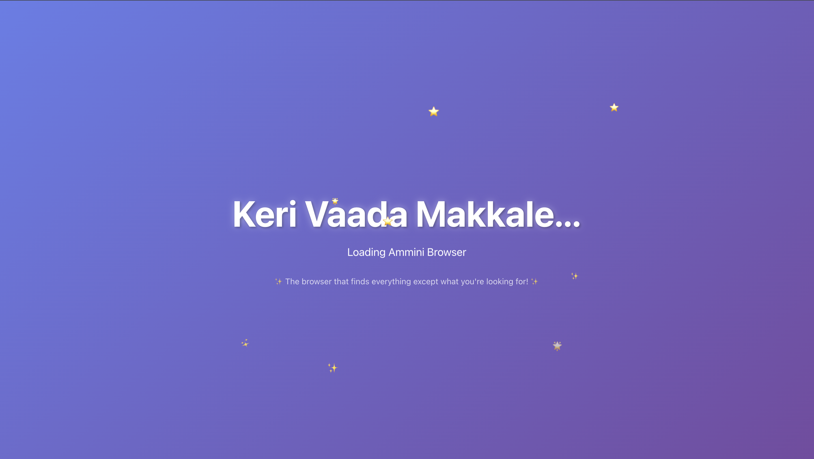

# Ammini Browser

## Basic Details
### Team Name: CodeFather

### Team Members
- Team Lead: Pawan Murali - SCMS SCHOOL OF ENGINEERING AND TECHNOLOGY
- Member 2: Omar Abdullah K A - SCMS SCHOOL OF ENGINEERING AND TECHNOLOGY  

### Project Description
A delightfully confusing web browser that embodies a loving grandmother who finds everything you're not looking for.

### The Problem (that doesn't exist)
Modern browsers are too efficient and show users what they search for, depriving them of the authentic experience of asking their grandmother for help with technology.

### The Solution (that nobody asked for)
We created Ammini Browser - a browser that deliberately misunderstands your searches and responds just like a real grandmother would!

## Technical Details
### Technologies/Components Used
For Software:
- React.js (Hooks: useState, useEffect)
- JavaScript ES6+
- CSS-in-JS (Inline Styling)
- JSON (Data Management)
- Giphy API (Character Animation)

### Implementation
For Software:
# Installation
```bash
git clone https://github.com/Omarabdullah9100/Ammini.git
cd Ammini
npm install
```

# Run
```bash
npm start
# Navigate to http://localhost:3000
```

### Project Documentation
For Software:

# Screenshots

*Welcome screen with floating animations and greeting "Keri Vaada Makkale"*


*Home screen featuring Ammini character and search functionality*


*Search results showing delightfully wrong results*

# Diagrams

## 🔍 AMMINI BROWSER ALGORITHM™ – Workflow

```mermaid
flowchart TD
    UI["📝 User Input"] --> BP["🧠 Ammini's Brain Processing"]

    BP -->|30% Chance| FM["😵 Forgetfulness Mode"]
    FM --> RH["🏠 Redirect to Home"]

    BP -->|70% Chance| CE["🎲 Confusion Engine"]
    CE --> TR["🔀 Topic Randomizer<br/>
               'JavaScript' → 🍛 Fish Curry Recipes<br/>
               'React' → 🎬 Malayalam Movies<br/>
               'Python' → 👵 Neighbor Stories<br/>
               'CSS' → 🌿 Ayurvedic Remedies"]

    TR --> RM["📚 Result Mixer<br/>
               + Cooking tips<br/>
               + Family stories<br/>
               + Movie references<br/>
               + Traditional wisdom"]

    RM --> WR["🎭 Display Wrong Results"]
    WR --> CF["📈 Increase Confusion Level<br/>(Loop continues)"]

    CF --> TR
```



# Project Demo

## Demo Video
https://github.com/user-attachments/assets/1fb04cf6-23ee-46eb-9564-c9206e80c9f6

- [📥 Download Demo Video](./demo/ammini-browser-demo.mp4) - Complete walkthrough (17.8 MB)


## Team Contributions
- Pawan Murali: Frontend development, browser features implementation, search algorithm design, animation effects
- Omar Abdullah K A: Backend logic, data management, UI/UX design, character integration and testing

---
Made with ❤️ at TinkerHub Useless Projects 


